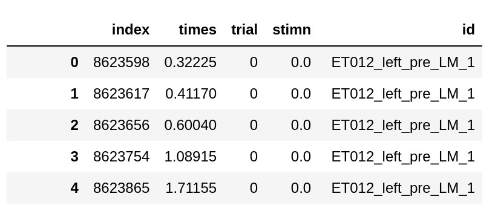

## Neural Connectivity
This project is an implementation to analyse information flows in simultaneous recorded visual areas using directed information(DI).

## Requirements 

* Python 3.8 

We can easily create the required Python environment using Conda as follows. 
```
conda create -n <env-name> python=3.8

conda activate <env-name>
```
Replace `<env-name>` with the desired environment name.


## Install Python libraries  
```
pip install -r requirements.txt
```


## Datasets

The datasets used in the analysis were [feather](https://github.com/wesm/feather) files with the format below. 
Each row indicate the spike of a unit at specified time within a given trial. 



* `times` - indicates the spike times in seconds.
* `trial` - the id of the trial 
* `stimn` - the id of stimulus under which the spike was recorded
* `id` - unit id (eg `ET012_left_pre_LM_1` refers to an `LM` unit with id `1` in a "pre" training experiment under a recording with id `ET012_left`) 

# Organization 
Folders 


* `code` - contains the main implementation to identify the directed information(DI) values between neuron groups(layers, cortical areas etc.) 

* `analysis` (and `notebooks/lasso-method` )  -  contain scripts for postprocessing and generating heatmaps and other analysis results


## Steps 
The following commands automate the process required for analysis 
### 1) Creating Configuration files 

The following step create the configuration files necessary for the analysis 

```
cd code 
python create_configuration.py --stimuli 9  --dataset <dataset-path> --output_dir ../../output 
```

The above commands create a configuration file  `../../output_stimuli_9/runner_<dataset-name>.yml`


### 2) Preprocessing data 

This step transforms the raw data to the expected format in the analysis.  


```
python preprocess_data.py --config <config-path> 
python prefilter_spikes.py --config <config-path> 
python find_active_times.py --config <config-path>
```

### 3) Calculating Directed Information 

```
python lasso_select_parentset.py --config <config-path>
```


We run the above three steps for all dataset("pre", "post_9", and "post_15") and all 25 stimuli in each dataset.

### 4) Postprocessing 

The postprocessing scripts aggregate the directed information(DI) results into the plots included in the manuscript. 

* `notebooks/lasso-method/Post Processing.ipynb` - shows the steps necessary to calculate p values and plot the results in a PDF format. 

## Citation 
Please consider citing the following work if you use the code in this repository. 
```
@article{tang2023visual,
  title={Visual experience induces 4--8 Hz synchrony between V1 and higher-order visual areas},
  author={Tang, Yu and Gervais, Catherine and Moffitt, Rylann and Nareddula, Sanghamitra and Zimmermann, Michael and Nadew, Yididiya Y and Quinn, Christopher J and Saldarriaga, Violeta and Edens, Paige and Chubykin, Alexander A},
  journal={Cell reports},
  volume={42},
  number={12},
  year={2023},
  publisher={Elsevier}
}
```
 
